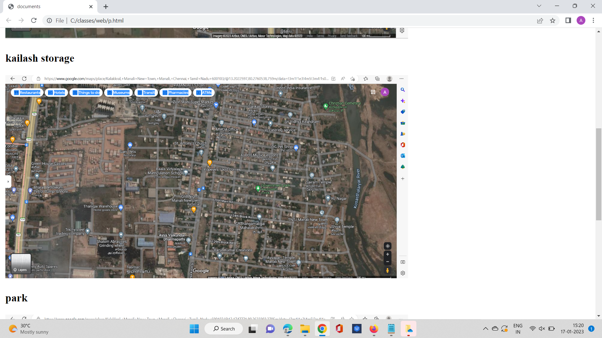
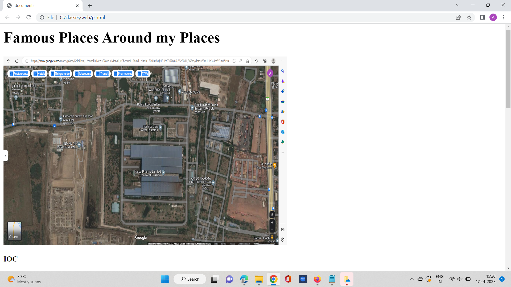
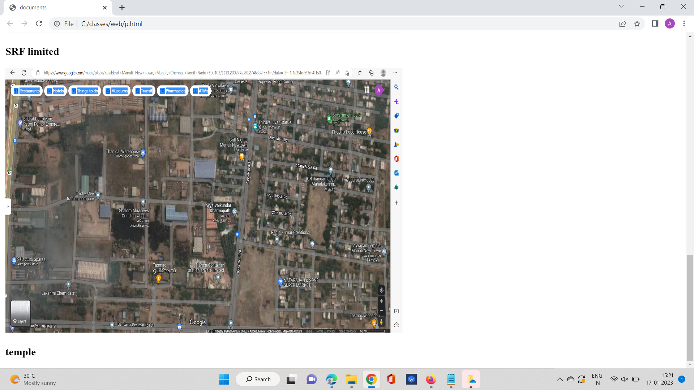

# Places Around Me
# Aim:
To develop a website to display details about the places around my house.

# Design Steps:
## Step 1

create a HTML file and add the images using img tag

## Step 2
describe the images(places)

## Step 3
commit the changes using the command and push to github respositary

# Code:
```
<!DOCTYPE html>
<html lang="en">
<head>
    <meta charset="UTF-8">
    <meta http-equiv="X-UA-Compatible" content="IE=edge">
    <meta name="viewport" content="width=device-width, initual-scale=1.0">
    <title>documents</title>
</head>
<body>
    <h1> Famous Places Around my Places</h1>
   <div></div>
   <p><b>IOC</b></p>
   <div> </div>
   <p><b>kailash storage</b></p>
   <div></div>
   <p><b>park</b></p>
   <div> </div> 
   <p><b>SRF limited</b></p>
   <div></div>
   <p><b>temple</b></p> 
</body>
</html>
```

# Output:
Famous places around me


Park


IOC


SRF Limited


!Temple

# Result:
By this program we got the expected output.
